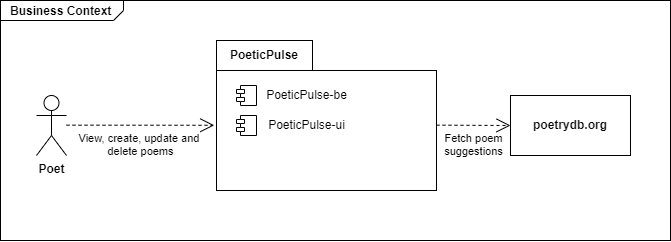

# System Scope and Context

This chapter describes the environment and context of poeticPulse: Who uses the system and on which other system does poeticPulse depend.

## Business Context

**Poet**  
A passionate poet that uses PoeticPulse to create, manage and store his poems.

**Poetrydb**  
A public web service called [PoetryDB](https://poetrydb.org/) that provides free access to a vast collection of poetry

## Technical Context

  
References between Components are depicted as directed arrows. The direction shows the call direction. Descriptions on the arrow are the used communication protocol on the application layer

**Browser**  
The web browser used to access the PoeticPulse-ui frontend application.

**Docker Provider Plattform**  
A docker environment that provides the needed running resources to the PoeticPulse Applications and its database. Can be a Kubernetes Cluster or a single application server running Docker.

**PoeticPulse-ui**  
Frontend Application for PoeticPulse. Uses [React](https://react.dev/) to provide user interfaces for the Browser. Calls the PoeticPulse-be to fetch poems or pass down user actions to manage poems. Runs as Docker container

**PoeticPulse-be**  
Backend Application for PoeticPulse. Uses [Spring Boot](https://spring.io/projects/spring-boot) to provide endpoints for the PoeticPulse-ui. It handles connections to the database to persist poems. PoeticPulse-be also fetches poems are suggestions from the external [poetrydb.org](https://poetrydb.org/) web service

**Database**  
[MongoDB](https://www.mongodb.com/) Database used to store poems created poems.

**Poetrydb**  
The public web service [PoetryDB](https://poetrydb.org/) that provides poems from a vast collection of poetry 