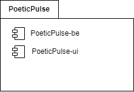
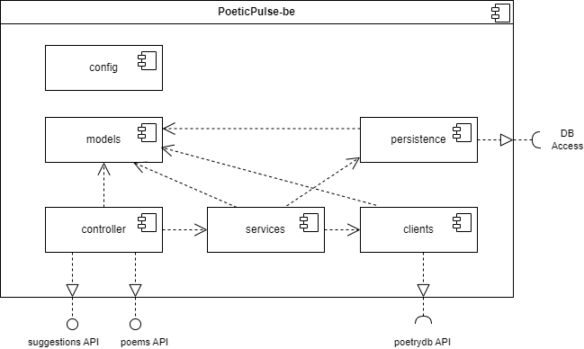
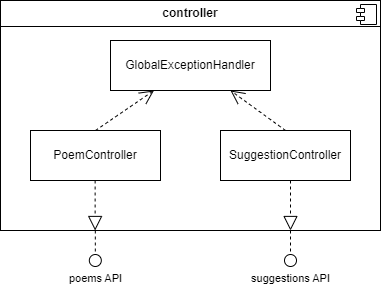
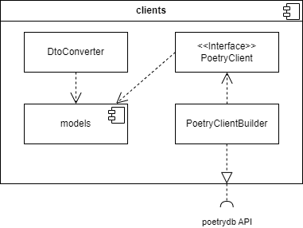
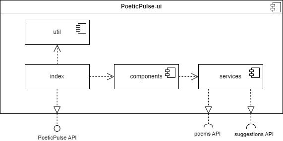

# Building Block View

The System packaged as PoeticPulse contains two main parts, as shown in the business context:

This section takes a closer look into PoeticPulse-be and PoeticPulse-ui. Both are depicted as Whiteboxes and its components are explained. Most basic components are explained as black boxes with an description. Components of higher Importance get their own whitebox presentation to further illuminate the detail.

## Whitebox PoeticPulse-be - Level 1

  

**contained blackboxes:**  
| Name        | Description                                                                                              |
| :---------- | :--------------------------------------------------------------------------------------------------- |
| config      | Autoloaded by application start up from Spring Boot. Configures cors route mappings                  |
| model       | Contains the domain model classes for PoeticPulse-be                                                 |
| services    | Contains business logic implementation and acts as layer between controller, clients and persistence |
| persistence | Takes care of the persistence of objects in the system and handles the connection to the database    |

**interfaces:**    
| Name            | Description                                                                                   |
| :-------------- | :-------------------------------------------------------------------------------------------- |
| suggestions API | REST API containing methods for fetching a suggestion poem                                    |
| poems API       | REST API containing methods for reading, adding, updating and deleting poems                  |
| poetrydb API    | REST API used to fetch publicly available famous poems                                        |
| DB Access       | Database Connection using the MongoDB Wire Protocol to select, create, update or delete poems |

### Whitebox controller - Level 2

**contained blackboxes:**  
| Name                   | Description                                                           |
| :--------------------- | :---------------------------------------------------------------- |
| PoemController         | handles incoming HTTP requests from the provided poems API        |
| SuggestionController   | handles incoming HTTP requests from the provided suggestions API  |
| GlobalExceptionHandler | catches and manages exceptions and provides appropriate responses |

### Whitebox clients - Level 2

**contained components:**  
| Name                | Description                                                                              |
| :------------------ | :----------------------------------------------------------------------------------- |
| PoetryClientBuilder | Builds a REST client to fetch poems from the poetrydb API                            |
| PoetryClient        | Contains information about the poetrydb API that the PoetryClientBuilder needs       |
| models (blackbox)   | Contains DTO model classes for the poetrydb API                                      |
| DtoConverter        | Contains logic to convert poetrydb DTO objects into poeticPulse domain model objects |

## Whitebox PoeticPulse-ui - Level 1

**contained components:**  
| Name       | Description                                                                                      |
| :--------- | :------------------------------------------------------------------------------------------- |
| util       | Configurates Web-Vitals to capture user experience metrics                                   |
| index      | Entry point and router to different react components                                         |
| components | stores react components like the PoemOverviewPage or PoemPage that are rendered for the user |
| services   | Contains logic to call the poems and suggestions APIs to manga poems and suggestions         |

**interfaces:**    
| Name            | Description                                                  |
| :-------------- | :----------------------------------------------------------- |
| PoeticPulse API | REST API with endpoints for the browser that return web-GUIs |
| poems API       | REST API used to read, add, update or delete poems           |
| suggestions API | REST API used to fetch suggestion poems                      |
