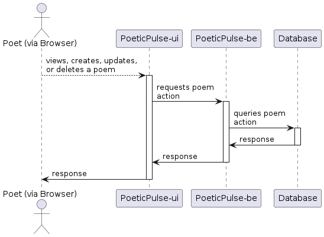
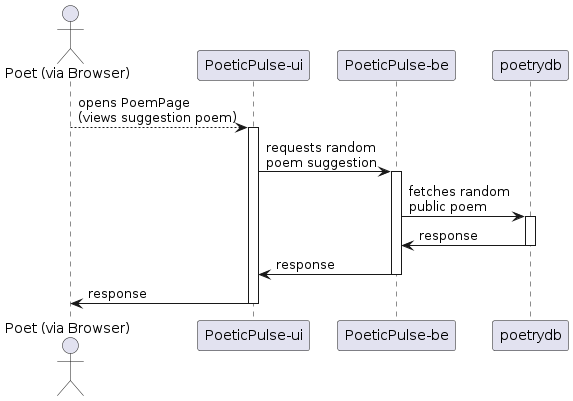

# Runtime View

User interaction with PoeticPulse is pretty basic and straight forward.

I picked up two uses cases where an actual runtime view is interesting:

## Scenario: Manage poems

## Scenario: Fetch poem suggestion

