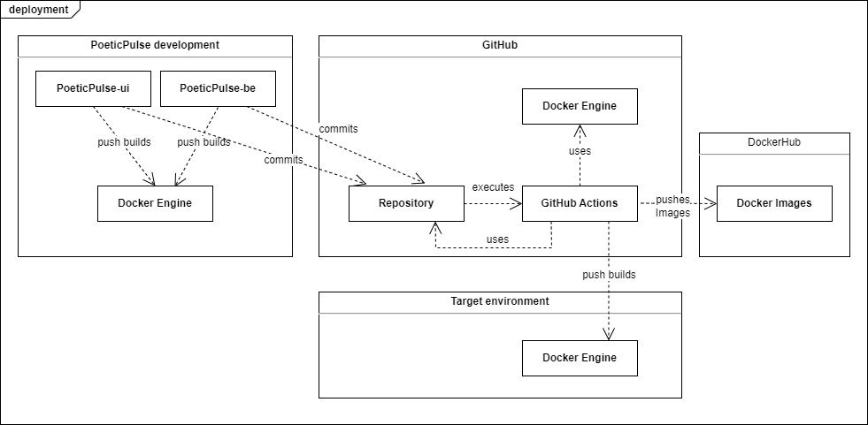

# Deployment View

| Artifact                | Description                                                                                                          |
| :---------------------- | :------------------------------------------------------------------------------------------------------------------- |
| PoeticPulse Development | Where local PoeticPulse development takes place, standard computer with JDK 21                                       |
| PoeticPulse-ui          | local development environment that uses npm or yarn for react as package manager and build tool                      |
| PoeticPulse-be          | local development environment that uses JDK 21 and gradle as package manager and build tool                          |
| Docker Engine           | Platform that runs the poeticPulse applications and its needed dependencies (for example the Database) in containers |
| GitHub                  | Provides a public code repository and CI/CD tools with GitHub Actions                                                |
| Repository              | Code Repository                                                                                                      |
| GitHub Actions          | automates build, test and depoyment workflows                                                                        |
| DockerHub               | Stores docker Images with different build versions of poeticPulse                                                    |
