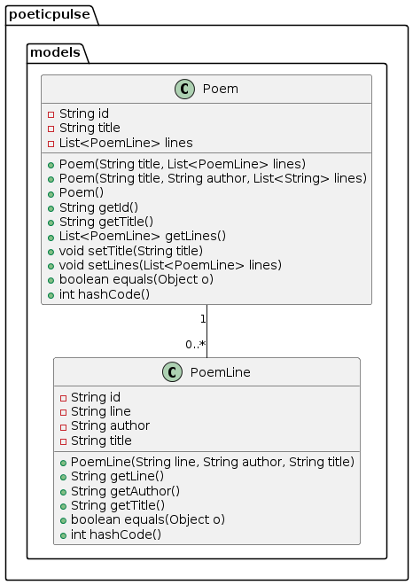

# Concepts

## Domain model

| Name     | Description                                                                                                                                                                                                                                       |
| :------- | :------------------------------------------------------------------------------------------------------------------------------------------------------------------------------------------------------------------------------------------------ |
| Poem     | Stores the title and has a List of PoemLines. The id field is used to simplify data management in the MongoDB                                                                                                                                     |
| PoemLine | Stores a line of a poem. The author and title field can be used, to store extra information of the related suggestion poem that influenced the creation of this single poem line. The id field is used to simplify data management in the MongoDB |

## Persistency

poeticPulse uses a MongoDB database for storing non-relational data. POJO Objects are saved directly trough MongoRepository Classes from the Spring Boot Data Framework. The Objects saved are from the class depicted in the Domain Model Concept.

During development and production the MongoDB is retained in a Docker container that is accessable for other poeticPulse containers. During build and test workflows this MongoDB is started with the Testcontainers library to have no external dependencies.

## Security

Since the System is desigend as a learning platform and to have only one user, security is disregarded. 

The provided HTTP endpoint offers no authentication.

## Exception and Error Handling

A global exception handler is used to provide to handle occurring exceptions or errors. This handles errors from external services like the poetrydb.org web service as well.

The application complies with a fail-fast principle for transparency and easier analysability. A trade-off with security will always favor transparency and analysability as already stated in the Security Concept.

## Health and Tracing

Spring Boot Actuator is used to provide health endpoints to observe the availability of the System. The actuator can also provide a tracing exporter or metric endpoints. If needed, this can be easily done by configuration.

## Configurability

Spring Boot offers an entire landscape of configuration options that can be found in their [commonly used configurations](https://docs.spring.io/spring-boot/index.html) page

Specific poeticPulse-be configuration properties:  
| Property                            | Default              | Description                                                 |
| :---------------------------------- | :------------------- | :---------------------------------------------------------- |
| poeticPulse.poetrydbAPI.baseUrl     | https://poetrydb.org | baseUrl of the external poetrydb web service                |
| poeticPulse.poetrydbAPI.feign.debug | true                 | logs additional input about queries to poetrydb web service |
| spring.data.mongodb.database        | poeticPulseDB        | Database name of the MongoDB                                |
| spring.data.mongodb.port            | 27017                | Database port of the MongoDB                                |
| spring.data.mongodb.host            | mongoDB              | Host name for the MongoDB                                   |

Specific poeticPulse-ui configuration properties:  
| Property                    | Default                    | Description                                  |
| :-------------------------- | :------------------------- | :------------------------------------------- |
| poeticPulse.backend.baseUrl | http://poeticPulse-be:8080 | baseUrl for the poeticPulse backeend service |

## Testability

To enable tests with external service the wiremock and feign-mock frameworks are used. These Technologies allow to mock a web service. This allows a external service failure to be simulated

## Build Management

PoeticPulse uses the packet managers npm or yarn for the frontend and gradle for the backend. These tools also provide necessary build tools. All actions can be executed from a command line interface
