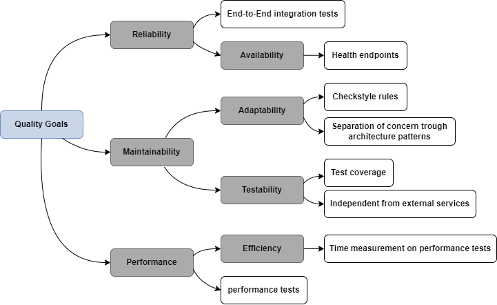

# Quality Requirements

### Quality Tree

### Evaluation Scenarios

**Reliability / End-to-End integration tests:**  
By using integration tests that cover the entire scope of actions a user (poet) can take.

**Adaptability / Checkstyle rules:**  
By using checkstyle and adapting a zero warning policy in the build and while development to ensure high quality and readable code.

**Testability / Test coverage:**  
By using JaCoCo during development and the build process ensure a code coverage of at least 90%

**Testability / Independet from external services:**  
By using wireMock and FeignMock to mock external services and even simulate outage of external services 

**Efficiency / Time measurement on performance tests:**  
By adding time measurements on the performance tests to ensure that response times doe not average over 2 seconds
